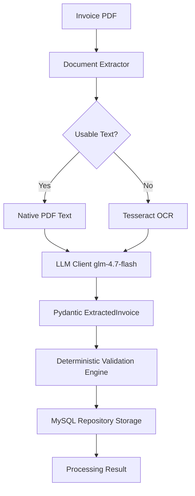
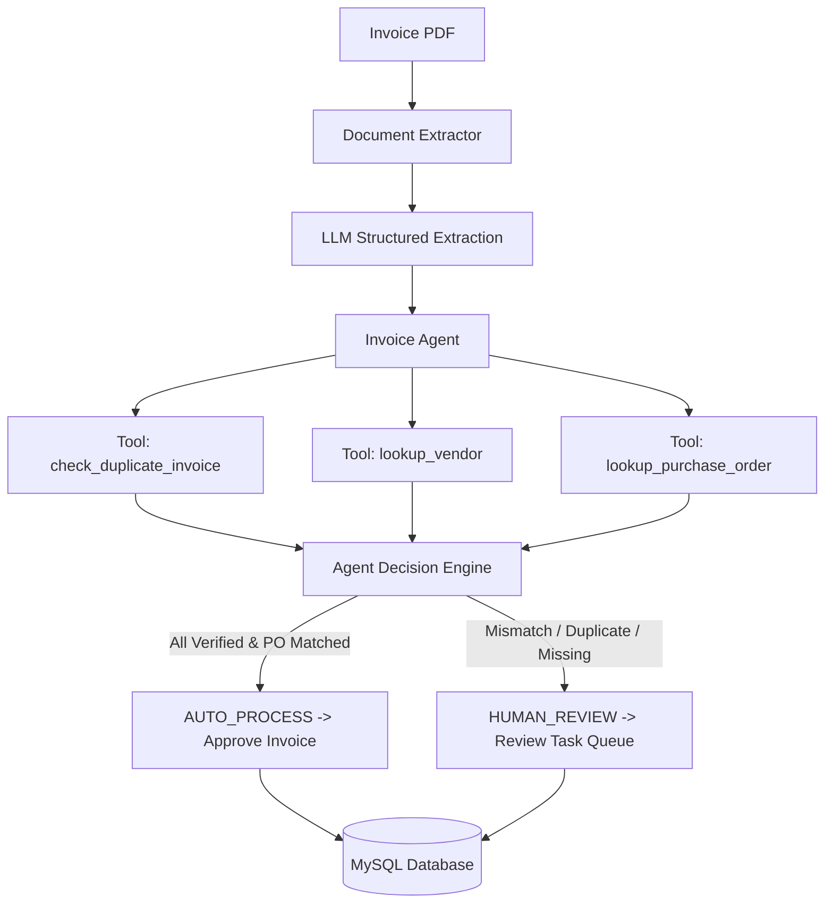

# AI Invoice Processing & Verification Platform

A production-grade, end-to-end **AI Invoice Processing & Verification Platform** built with **Python 3.11**, **PyMuPDF**, **Tesseract OCR**, **OpenAI-compatible LLMs (GLM-4.7-Flash)**, **FastAPI**, **Pydantic**, and **MySQL Server 8.0**.

Inspired by the **Agentic AI course from DeepLearning.AI by Andrew Ng**, this platform transitions from a deterministic baseline processing pipeline into an **Autonomous Agentic AI Workflow** equipped with specialized domain verification tools.

---

## 🌟 Key Features

- **Dual Extraction Pipeline**: Fast native PDF text extraction via PyMuPDF (`fitz`) with automatic high-DPI rendering and **Tesseract OCR fallback** for scanned/rasterized documents.
- **LLM Structured Parsing**: OpenAI-compatible client abstraction targeting `glm-4.7-flash:latest` with JSON mode enforcement and versioned system prompts (`invoice_extraction_v1.txt`).
- **Pydantic Schemas**: Strongly-typed models with `Decimal` precision for financial totals, `date` fields, and nested line items.
- **Deterministic Validation Engine**: 7 business rules verifying grand totals, line items arithmetic, date sanity (`due_date >= invoice_date`), and field completeness without relying on LLM for math.
- **Agentic AI Layer**: Autonomous decision agent (`InvoiceAgent`) executing tool calls:
  - `lookup_vendor`: Vendor master registry lookup.
  - `lookup_purchase_order`: PO verification and authorized amount matching.
  - `check_duplicate_invoice`: Duplicate detection looking up vendor + invoice_number pairs.
  - `create_review_task`: Human-in-the-loop task queue routing.
- **MySQL Relational Storage**: Full database layer built with SQLAlchemy 2.0 and PyMySQL for master vendors, customers, invoices, line items, validation logs, and review tasks.
- **FastAPI REST API Backend**: OpenAPI Swagger documentation served at `/docs`, supporting PDF file upload processing and human-in-the-loop approval/rejection endpoints.
- **CLI & Evaluation Framework**: Command-line pipeline runner and benchmark evaluation suite measuring extraction accuracy, OCR trigger rate, and latency.

---

## 📐 Architecture & Workflow Evolution

### 1. Initial Deterministic Workflow 



### 2. Autonomous Agentic AI Workflow



---

## 🛠️ Technology Stack

- **Language**: Python 3.11.9
- **PDF & Document Processing**: PyMuPDF (`fitz`), Pillow (`PIL`)
- **OCR Engine**: Tesseract OCR v5.5.0 (`pytesseract`)
- **LLM Provider**: GLM-4 (`glm-4.7-flash:latest`) via OpenAI-compatible SDK (`openai`)
- **Data Validation & Schemas**: Pydantic v2, Pydantic-Settings
- **Database Layer**: MySQL Server 8.0, SQLAlchemy 2.0, PyMySQL
- **Web API Backend**: FastAPI, Uvicorn, Starlette
- **Testing & Benchmarking**: Pytest, ReportLab (synthetic PDF generator)

---

## 🚀 Environment Setup

### 1. Prerequisites
- **Python 3.11.x** (Verify with `python --version`)
- **Tesseract OCR** (Installed at `C:\Program Files\Tesseract-OCR\tesseract.exe`)
- **MySQL Server 8.0** running locally

### 2. Virtual Environment Setup
```powershell
# Clone the repository
git clone https://github.com/Nekilesh001/invoice-processing-workflow.git
cd invoice_workflow

# Create Python 3.11 virtual environment
py -3.11 -m venv .venv

# Activate environment
.\.venv\Scripts\Activate.ps1

# Install dependencies
pip install -r requirements.txt
```

### 3. Environment Configuration (`.env`)
Create a `.env` file in the root directory (based on `.env.example`):
```ini
LLM_PROVIDER=openai_compatible
LLM_MODEL=glm-4.7-flash:latest
LLM_BASE_URL=https://open.bigmodel.cn/api/paas/v4/
LLM_API_KEY=your_actual_glm_api_key_here

TESSERACT_CMD=C:\Program Files\Tesseract-OCR\tesseract.exe

DB_HOST=localhost
DB_PORT=3306
DB_NAME=invoice_db
DB_USER=root
DB_PASSWORD=your_mysql_password
```

---

## 🧪 Synthetic Dataset & CLI Pipeline Runner

### Generate Synthetic Test Invoices
Generate sample test invoices (normal, missing due date, missing vendor, invalid total arithmetic, and scanned OCR image PDF):
```powershell
python scripts/generate_synthetic_invoices.py
```

### Run CLI Pipeline Runner
Process a single invoice or an entire directory of invoices:
```powershell
# Process directory of sample invoices (using SQLite fallback or MySQL)
python scripts/process_invoice.py --dir data/sample_invoices --sqlite

# Process single invoice PDF
python scripts/process_invoice.py --file data/sample_invoices/invoice_001_normal.pdf
```

---

## ⚡ FastAPI Web Server & API Documentation

Launch the production FastAPI server:
```powershell
uvicorn app.main:app --reload --port 8000
```
Access the interactive OpenAPI Swagger UI at: **`http://localhost:8000/docs`**

### REST API Endpoints Overview

| Method | Endpoint | Description |
| :--- | :--- | :--- |
| `POST` | `/api/v1/invoices/process` | Upload invoice PDF/image for processing |
| `GET` | `/api/v1/invoices` | List processed invoices (with status filter) |
| `GET` | `/api/v1/invoices/{id}` | Get full invoice details and line items |
| `GET` | `/api/v1/invoices/{id}/validation` | Query validation execution history |
| `GET` | `/api/v1/reviews` | List pending human review tasks |
| `POST` | `/api/v1/reviews/{id}/approve` | Reviewer manual approval endpoint |
| `POST` | `/api/v1/reviews/{id}/reject` | Reviewer manual rejection endpoint |
| `GET` | `/health` | Server health check endpoint |

---

## 📊 Evaluation Benchmark Framework

Run the automated performance evaluation suite across test documents:
```powershell
python scripts/evaluate_pipeline.py
```
**Sample Benchmark Output:**
```text
DOCUMENT                            | METHOD     | CHARS  | TIME(ms) | STATUS
----------------------------------------------------------------------
invoice_001_normal.pdf              | native_pdf | 713    | 4.1      | SUCCESS
invoice_002_missing_due_date.pdf    | native_pdf | 442    | 2.3      | SUCCESS
invoice_003_missing_vendor.pdf      | native_pdf | 309    | 1.7      | SUCCESS
invoice_004_invalid_total.pdf       | native_pdf | 338    | 1.3      | SUCCESS
invoice_006_scanned_invoice.pdf     | ocr        | 353    | 350.2    | SUCCESS
----------------------------------------------------------------------
Native PDF Extractions    : 80.0%
Tesseract OCR Fallbacks   : 20.0%
Average Extraction Latency: 71.94 ms
```

---

## 🔬 Automated Testing (`pytest`)

Execute the complete unit and integration test suite:
```powershell
pytest
```
*Output: `29 passed in 1.42s`*

---

## 🗄️ Database Schema Design

The relational database layer (`app/database/models.py`) consists of:
- `vendors`: Master vendor registry (`id`, `name`, `tax_id`, `email`, `address`).
- `customers`: Master customer registry (`id`, `name`, `tax_id`, `email`, `address`).
- `invoices`: Invoice headers (`invoice_number`, `vendor_id`, `customer_id`, `po_number`, `dates`, `totals`, `status`).
- `invoice_line_items`: Invoice line items (`invoice_id`, `description`, `quantity`, `unit_price`, `line_total`).
- `invoice_validation_results`: Validation run audit log (`errors_json`, `warnings_json`).
- `review_tasks`: Human-in-the-loop review queue entries (`reason`, `status`, `assigned_to`).

---

## 🛡️ Security & Prompt Engineering

- **Untrusted Input Isolation**: System instructions in `invoice_extraction_v1.txt` explicitly isolate OCR document text, preventing prompt injection attacks from malicious text embedded inside invoices.
- **Strict Non-Fabrication Policy**: Missing document fields are explicitly coerced to `null` rather than model hallucinated fallbacks.
- **Secret Isolation**: Secrets (`LLM_API_KEY`, `DB_PASSWORD`) are loaded strictly from `.env` and excluded from source control.

---

## 📜 License

This project is licensed under the MIT License.
