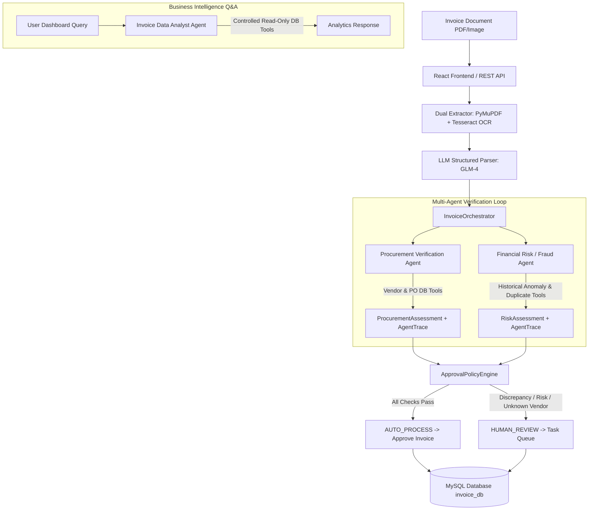

# AI Multi-Agent Invoice Verification Platform

A production-grade, end-to-end **AI Multi-Agent Invoice Verification Platform** built with **Python 3.11**, **React 19 + Vite**, **WebGL 3D Shaders (`ogl`)**, **PyMuPDF**, **Tesseract OCR**, **OpenAI-compatible LLMs (GLM-4.7-Flash)**, **FastAPI**, **Pydantic**, and **MySQL Server 8.0**.

Inspired by the **Agentic AI course from DeepLearning.AI by Andrew Ng**, this platform features a genuine **Multi-Agent Architecture** coordinating three specialized autonomous agents, an orchestrator, and a deterministic financial governance engine.

---

## 🌟 Key Features

- **Multi-Agent Verification Architecture**:
  - 🛒 **Procurement Verification Agent** (`ProcurementAgent`): Validates vendor registration in master registry, queries purchase order status, checks authorized balances, and performs line-item matching.
  - 🛡️ **Financial Risk / Fraud Agent** (`FinancialRiskAgent`): Evaluates duplicate invoice submissions, invoice total anomalies vs vendor historical averages, and suspicious numbering patterns.
  - 📊 **Invoice Data Analyst Agent** (`InvoiceDataAnalystAgent`): Natural-language accounts payable business intelligence assistant (`POST /api/v1/analytics/ask`) using controlled, read-only SQL query tools.
- **Deterministic Approval Policy Engine** (`ApprovalPolicyEngine`): Specialist agents return structured assessments (`ProcurementAssessment`, `RiskAssessment`), while the policy engine enforces final `AUTO_PROCESS` vs `HUMAN_REVIEW` safety boundaries.
- **Multi-Agent Orchestrator** (`InvoiceOrchestrator`): Coordinates specialist agent execution and aggregates structured evaluation state and agent execution traces.
- **Interactive Web UI Dashboard**: React frontend (`frontend/`) featuring dark glassmorphism design system, interactive **Invoice Data Analyst Assistant** widget with preset query pills, live agent trace viewer, and specialized Multi-Agent Verification summary cards.
- **Dual Extraction Pipeline**: Fast native PDF text extraction via PyMuPDF (`fitz`) with automatic high-DPI rendering and **Tesseract OCR fallback** for scanned/rasterized documents.
- **LLM Structured Parsing**: OpenAI-compatible client abstraction targeting `glm-4.7-flash:latest` with JSON mode enforcement and versioned system prompts (`invoice_extraction_v1.txt`).
- **Deterministic Validation Engine**: 7 business rules verifying grand totals, line items arithmetic, date sanity (`due_date >= invoice_date`), and field completeness without relying on LLM for math.
- **MySQL Relational Storage**: Database schema built with SQLAlchemy 2.0 and PyMySQL for master vendors, customers, purchase orders, invoices, line items, validation logs, and review tasks with `UniqueConstraint` indices.
- **Authentication & RBAC**: JWT Bearer token authentication (`POST /api/v1/auth/login`) with role-based access control (`ADMIN`, `AP_MANAGER`, `REVIEWER`, `VIEWER`) and reviewer identity tracking on all audit actions.
- **Comprehensive Test Suite**: 96 automated unit and integration tests passing in ~3.5 seconds (`pytest`).
- **AI System Evaluation Benchmark**: Evaluation suite (`scripts/evaluate_pipeline.py`) measuring extraction accuracy, OCR fallback rate, PO line matching correctness, zero unsafe auto-approvals, and stage-by-stage execution latency.

---

## 📐 Multi-Agent Architecture & Workflow



---

## 🛠️ Technology Stack

- **Frontend**: React 19, Vite, WebGL 3D Shaders (`ogl`), Lucide Icons, Glassmorphism CSS System
- **Backend Language**: Python 3.11.9
- **PDF & Document Processing**: PyMuPDF (`fitz`), Pillow (`PIL`)
- **OCR Engine**: Tesseract OCR v5.5.0 (`pytesseract`)
- **LLM Provider**: GLM-4 (`glm-4.7-flash:latest`) via OpenAI-compatible SDK (`openai`)
- **Data Validation & Schemas**: Pydantic v2, Pydantic-Settings
- **Database Layer**: MySQL Server 8.0, SQLAlchemy 2.0, PyMySQL
- **Web API Backend**: FastAPI, Uvicorn, Starlette
- **Testing & Benchmarking**: Pytest (96 unit & integration tests), ReportLab

---

## 🚀 Environment Setup & Running

### 1. Prerequisites
- **Python 3.11.x** (Verify with `python --version`)
- **Node.js v20+** & **npm** (Verify with `node --version`)
- **Tesseract OCR** (Installed at `C:\Program Files\Tesseract-OCR\tesseract.exe`)
- **MySQL Server 8.0** running locally

### 2. Virtual Environment & Backend Setup
```powershell
# Clone the repository
git clone https://github.com/Nekilesh001/invoice-processing-workflow.git
cd invoice_workflow

# Create Python 3.11 virtual environment
py -3.11 -m venv .venv
.\.venv\Scripts\Activate.ps1

# Install dependencies
pip install -r requirements.txt
```

### 3. Environment Configuration (`.env`)
Create a `.env` file in the root directory:
```ini
LLM_PROVIDER=openai_compatible
LLM_MODEL=glm-4.7-flash:latest
LLM_BASE_URL=https://open.bigmodel.cn/api/paas/v4/
LLM_API_KEY=your_api_key_here

TESSERACT_CMD=C:\Program Files\Tesseract-OCR\tesseract.exe

DB_HOST=localhost
DB_PORT=3306
DB_NAME=invoice_db
DB_USER=root
DB_PASSWORD=your_password_here
```

### 4. Run Application & Web Frontend

#### Start Backend FastAPI Server:
```powershell
.\.venv\Scripts\uvicorn.exe app.main:app --reload --port 8000
```
- Open **`http://localhost:8000`** in your browser for the Web Dashboard!
- Open **`http://localhost:8000/docs`** for interactive Swagger REST API docs!

#### Start Vite Frontend Development Server:
```powershell
npm --prefix frontend run dev
```
- Open **`http://localhost:5173`** for Vite dev server!

---

## 🧪 Synthetic Dataset & CLI Pipeline Runner

```powershell
# Generate sample test invoices
python scripts/generate_synthetic_invoices.py

# Process directory of sample invoices
python scripts/process_invoice.py --dir data/sample_invoices

# Process single invoice PDF
python scripts/process_invoice.py --file data/sample_invoices/invoice_001_normal.pdf
```

---

## 🔬 Automated Testing (`pytest`)

Execute the complete unit and integration test suite (96 tests):
```powershell
.\.venv\Scripts\pytest.exe
```
*Output: `96 passed in 3.42s`*

---

## 📊 Evaluation Benchmark

Run the Multi-Agent evaluation benchmark script:
```powershell
.\.venv\Scripts\python.exe scripts/evaluate_pipeline.py
```

---

## 📜 License

This project is licensed under the MIT License.
