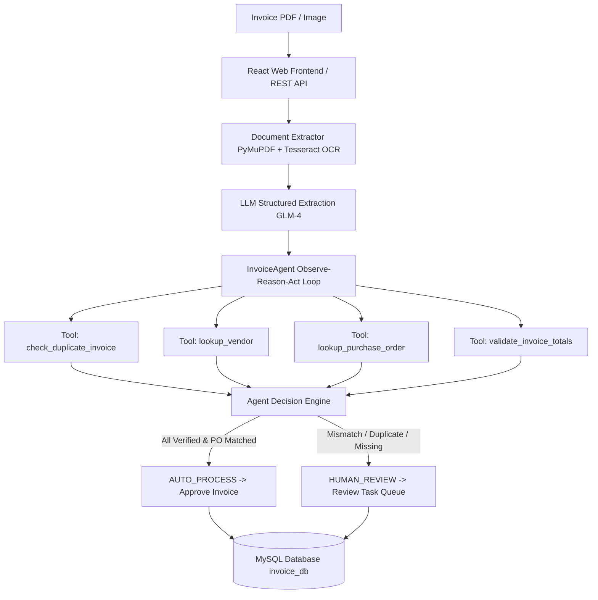

# AI Invoice Processing & Verification Platform

A production-grade, end-to-end **AI Invoice Processing & Verification Platform** built with **Python 3.11**, **React 19 + Vite**, **WebGL 3D Shaders (`ogl`)**, **PyMuPDF**, **Tesseract OCR**, **OpenAI-compatible LLMs (GLM-4.7-Flash)**, **FastAPI**, **Pydantic**, and **MySQL Server 8.0**.

Inspired by the **Agentic AI course from DeepLearning.AI by Andrew Ng**, this platform transitions from a deterministic baseline processing pipeline into an **Autonomous Agentic AI Workflow** equipped with specialized domain verification tools and a modern Web UI.

---

## 🌟 Key Features

- **Modern Web Frontend Dashboard**: Interactive React frontend (`frontend/`) featuring a custom **WebGL 3D Prism Raymarching Shader canvas** (`ogl`), dark glassmorphism design system, drag-and-drop invoice upload, live agent trace viewer, and human review queue panel.
- **Dual Extraction Pipeline**: Fast native PDF text extraction via PyMuPDF (`fitz`) with automatic high-DPI rendering and **Tesseract OCR fallback** for scanned/rasterized documents.
- **LLM Structured Parsing**: OpenAI-compatible client abstraction targeting `glm-4.7-flash:latest` with JSON mode enforcement and versioned system prompts (`invoice_extraction_v1.txt`).
- **Pydantic Schemas**: Strongly-typed models with `Decimal` precision for financial totals, `date` fields, and nested line items.
- **Deterministic Validation Engine**: 7 business rules verifying grand totals, line items arithmetic, date sanity (`due_date >= invoice_date`), and field completeness without relying on LLM for math.
- **Autonomous Agentic AI Layer**: Observe-Reason-Act tool-calling agent (`InvoiceAgent`) executing domain verification tools:
  - `lookup_vendor`: Master vendor registry lookup.
  - `lookup_purchase_order`: PO verification and authorized amount matching.
  - `check_duplicate_invoice`: Database-level duplicate detection.
  - `validate_invoice_totals`: Line item math verification tool.
  - `create_review_task`: Idempotent human-in-the-loop task queue routing.
- **MySQL Relational Storage**: Database schema built with SQLAlchemy 2.0 and PyMySQL for master vendors, customers, invoices, line items, validation logs, and review tasks with `UniqueConstraint("vendor_id", "invoice_number")`.
- **FastAPI REST API Backend**: OpenAPI Swagger documentation served at `/docs`, supporting PDF file upload processing and human-in-the-loop approval/rejection endpoints.
- **CLI & Evaluation Framework**: Command-line pipeline runner and benchmark evaluation suite measuring extraction accuracy, OCR trigger rate, and latency.

---

## 📐 Architecture & Workflow



---

## 🛠️ Technology Stack

- **Frontend**: React 19, Vite, WebGL 3D Shaders (`ogl`), Lucide Icons, Glassmorphism CSS System
- **Backend Language**: Python 3.11.9
- **PDF & Document Processing**: PyMuPDF (`fitz`), Pillow (`PIL`)
- **OCR Engine**: Tesseract OCR v5.5.0 (`pytesseract`)
- **LLM Provider**: GLM-4 (`glm-4.7-flash:latest`) via OpenAI-compatible SDK (`openai`)
- **Data Validation & Schemas**: Pydantic v2, Pydantic-Settings
- **Database Layer**: MySQL Server 8.0, SQLAlchemy 2.0, PyMySQL
- **Web API Backend**: FastAPI, Uvicorn, Starlette
- **Testing & Benchmarking**: Pytest (45 unit & integration tests), ReportLab

---

## 🚀 Environment Setup & Running

### 1. Prerequisites
- **Python 3.11.x** (Verify with `python --version`)
- **Node.js v20+** & **npm** (Verify with `node --version`)
- **Tesseract OCR** (Installed at `C:\Program Files\Tesseract-OCR\tesseract.exe`)
- **MySQL Server 8.0** running locally

### 2. Virtual Environment & Backend Setup
```powershell
# Clone the repository
git clone https://github.com/Nekilesh001/invoice-processing-workflow.git
cd invoice_workflow

# Create Python 3.11 virtual environment
py -3.11 -m venv .venv
.\.venv\Scripts\Activate.ps1

# Install dependencies
pip install -r requirements.txt
```

### 3. Environment Configuration (`.env`)
Create a `.env` file in the root directory:
```ini
LLM_PROVIDER=openai_compatible
LLM_MODEL=glm-4.7-flash:latest
LLM_BASE_URL=http://115.247.148.78:3002/api
LLM_API_KEY=sk-bec5d009a9b64886851eb3fbe971fa15

TESSERACT_CMD=C:\Program Files\Tesseract-OCR\tesseract.exe

DB_HOST=localhost
DB_PORT=3306
DB_NAME=invoice_db
DB_USER=root
DB_PASSWORD=MyNewPassword@123
```

### 4. Run Application & Web Frontend

#### Option A: Single Command (FastAPI serves API + Web App)
```powershell
.\.venv\Scripts\uvicorn app.main:app --reload --port 8000
```
- Open **`http://localhost:8000`** in your browser for the Web Dashboard!
- Open **`http://localhost:8000/docs`** for interactive Swagger REST API docs!

#### Option B: Vite Frontend Development Server (Hot Reloading)
```powershell
cd frontend
npm install
npm run dev
```
- Open **`http://localhost:5173`** for Vite dev server!

---

## 🧪 Synthetic Dataset & CLI Pipeline Runner

```powershell
# Generate sample test invoices
python scripts/generate_synthetic_invoices.py

# Process directory of sample invoices
python scripts/process_invoice.py --dir data/sample_invoices

# Process single invoice PDF
python scripts/process_invoice.py --file data/sample_invoices/invoice_001_normal.pdf
```

---

## 🔬 Automated Testing (`pytest`)

Execute the complete unit and integration test suite:
```powershell
pytest
```
*Output: `45 passed in 9.63s`*

---

## 📜 License

This project is licensed under the MIT License.
