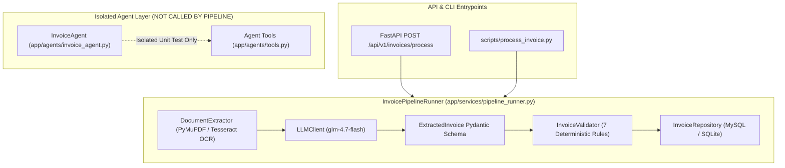

# Deep Architecture & Agentic AI Audit Report

**Repository**: `invoice_workflow`  
**GitHub**: `https://github.com/Nekilesh001/invoice-processing-workflow`  
**Audit Date**: August 21, 2026  
**Auditor**: Senior Software & AI Engineer  

---

## 1. Executive Summary

This audit evaluates the codebase of the **AI Invoice Processing & Verification Platform** against the core Agentic AI principles taught in the DeepLearning.AI Agentic AI course by Andrew Ng.

### Key Finding
The current implementation is a **Hybrid System** combining:
1. A **robust LLM-powered document extraction pipeline** (`PyMuPDF` + `Tesseract OCR` + `GLM-4.7-Flash` + `Pydantic` + `SQLAlchemy`).
2. A **deterministic rule-based decision router** wrapped inside a class named `InvoiceAgent`.

While the project demonstrates high software engineering standards (clean separation of concerns, strong typing with `Decimal`, explicit validation rules, transactional persistence, and automated test coverage), **the component named `InvoiceAgent` is currently NOT a true agentic system**. 

It uses **hardcoded Python `if`/`else` control flow** to invoke Python functions rather than an LLM-driven reasoning loop (ReAct / observe-reason-act cycle with dynamic tool selection). Furthermore, **the main pipeline orchestrator (`InvoicePipelineRunner`) and FastAPI endpoints do not actually invoke `InvoiceAgent` at runtime**, leaving the agent completely unintegrated from active invoice processing.

---

## 2. Actual Architecture

The actual system architecture implemented across the repository differs slightly from docstrings and README claims:



### Key Architectural Discrepancies
1. **Unintegrated Agent**: `InvoiceAgent` is never instantiated or called within `app/services/pipeline_runner.py` or `app/api/endpoints/invoices.py`. It exists solely in `app/agents/` and is called only in `tests/unit/test_agent.py`.
2. **Missing `pyproject.toml`**: Referenced in project structure documentation, but only `requirements.txt` exists on disk.
3. **No Multi-Page PDF Handling in OCR**: `DocumentExtractor` renders pages into a single string stream without page-level confidence or bounding box tracking.

---

## 3. Component Classification

| Component | File Path | Classification | Why |
| :--- | :--- | :--- | :--- |
| **Settings Configuration** | [`app/config.py`](file:///d:/ONE_DATA/DeepLearning.AI/agentic-ai-hands-on/invoice_workflow/app/config.py) | **Deterministic Workflow** | Loads `.env` parameters using `pydantic-settings`. |
| **Document Cleaner** | [`app/extraction/cleaner.py`](file:///d:/ONE_DATA/DeepLearning.AI/agentic-ai-hands-on/invoice_workflow/app/extraction/cleaner.py) | **Deterministic Workflow** | Pure regex string normalization. |
| **PDF / OCR Extractor** | [`app/extraction/extractor.py`](file:///d:/ONE_DATA/DeepLearning.AI/agentic-ai-hands-on/invoice_workflow/app/extraction/extractor.py) | **Deterministic Workflow** | PyMuPDF text extraction with threshold-based fallback to `pytesseract`. |
| **Pydantic Schemas** | [`app/schemas/invoice.py`](file:///d:/ONE_DATA/DeepLearning.AI/agentic-ai-hands-on/invoice_workflow/app/schemas/invoice.py) | **Deterministic Workflow** | Data contract and type validation (`Decimal`, `date`). |
| **System Prompt** | [`app/prompts/invoice_extraction_v1.txt`](file:///d:/ONE_DATA/DeepLearning.AI/agentic-ai-hands-on/invoice_workflow/app/prompts/invoice_extraction_v1.txt) | **LLM-Powered Step** | Versioned prompt steering LLM structured output. |
| **LLM Client** | [`app/llm/client.py`](file:///d:/ONE_DATA/DeepLearning.AI/agentic-ai-hands-on/invoice_workflow/app/llm/client.py) | **LLM-Powered Step** | OpenAI-compatible SDK call to `glm-4.7-flash:latest` with JSON mode. |
| **Extraction Service** | [`app/services/extraction_service.py`](file:///d:/ONE_DATA/DeepLearning.AI/agentic-ai-hands-on/invoice_workflow/app/services/extraction_service.py) | **LLM-Powered Step** | Connects `DocumentExtractor` with `LLMClient`. |
| **Validation Engine** | [`app/validation/validator.py`](file:///d:/ONE_DATA/DeepLearning.AI/agentic-ai-hands-on/invoice_workflow/app/validation/validator.py) | **Business Rule** | 7 hardcoded Python mathematical and completeness checks. |
| **Database Models** | [`app/database/models.py`](file:///d:/ONE_DATA/DeepLearning.AI/agentic-ai-hands-on/invoice_workflow/app/database/models.py) | **Database Operation** | SQLAlchemy ORM tables (`vendors`, `invoices`, `review_tasks`). |
| **Invoice Repository** | [`app/database/repositories/invoice_repository.py`](file:///d:/ONE_DATA/DeepLearning.AI/agentic-ai-hands-on/invoice_workflow/app/database/repositories/invoice_repository.py) | **Database Operation** | Transactional SQL creation, lookup, and duplicate checking. |
| **Pipeline Runner** | [`app/services/pipeline_runner.py`](file:///d:/ONE_DATA/DeepLearning.AI/agentic-ai-hands-on/invoice_workflow/app/services/pipeline_runner.py) | **Deterministic Workflow** | Sequential orchestrator binding extraction, LLM, validation, and SQL. |
| **Agent Verification Tools** | [`app/agents/tools.py`](file:///d:/ONE_DATA/DeepLearning.AI/agentic-ai-hands-on/invoice_workflow/app/agents/tools.py) | **Tool** | Python helper functions (`lookup_vendor`, `lookup_purchase_order`, etc.). |
| **Invoice Agent** | [`app/agents/invoice_agent.py`](file:///d:/ONE_DATA/DeepLearning.AI/agentic-ai-hands-on/invoice_workflow/app/agents/invoice_agent.py) | **Deterministic Workflow** | Named `InvoiceAgent`, but uses hardcoded Python `if`/`else` control flow. |
| **REST API** | [`app/main.py`](file:///d:/ONE_DATA/DeepLearning.AI/agentic-ai-hands-on/invoice_workflow/app/main.py), [`app/api/`](file:///d:/ONE_DATA/DeepLearning.AI/agentic-ai-hands-on/invoice_workflow/app/api) | **API Layer** | FastAPI application exposing endpoints and OpenAPI docs. |
| **Review Endpoints** | [`app/api/endpoints/reviews.py`](file:///d:/ONE_DATA/DeepLearning.AI/agentic-ai-hands-on/invoice_workflow/app/api/endpoints/reviews.py) | **Human-in-the-Loop** | Endpoints allowing human reviewers to approve or reject flagged invoices. |
| **Evaluation Suite** | [`scripts/evaluate_pipeline.py`](file:///d:/ONE_DATA/DeepLearning.AI/agentic-ai-hands-on/invoice_workflow/scripts/evaluate_pipeline.py) | **Evaluation Component** | Benchmark script calculating accuracy, latency, and OCR rates. |

---

## 4. End-to-End Invoice Execution Trace

Tracing the execution of `data/sample_invoices/invoice_001_normal.pdf` through the real code path:

```text
invoice_001_normal.pdf
 ↓
1. Entrypoint: process_invoice_upload() [app/api/endpoints/invoices.py:17]
   Input : UploadFile (PDF bytes)
   Action: Instantiates InvoicePipelineRunner() and calls process_file()
 ↓
2. Orchestrator: InvoicePipelineRunner.process_file() [app/services/pipeline_runner.py:31]
   Input : file_bytes, file_name="invoice_001_normal.pdf"
 ↓
3. Extraction: DocumentExtractor.extract() [app/extraction/extractor.py:43]
   Input : file_bytes
   Action: Opens PDF via PyMuPDF (fitz). Extracts 713 native characters.
   Result: total_native_chars (713) >= threshold (20) -> extraction_method = "native_pdf"
   Output: ExtractionResult(cleaned_text="TAX INVOICE Acme Cloud Solutions...", extraction_method="native_pdf")
 ↓
4. LLM Extraction: LLMClient.extract_invoice_json() [app/llm/client.py:56]
   Input : cleaned_text, system_prompt from app/prompts/invoice_extraction_v1.txt
   Action: Sends chat completion request to GLM-4 endpoint (model="glm-4.7-flash:latest") with response_format={"type": "json_object"}
   Output: Raw JSON dict {"invoice_number": "INV-2026-001", "total_amount": 3300.00, ...}
 ↓
5. Schema Validation: ExtractedInvoice.model_validate() [app/schemas/invoice.py:58]
   Input : Raw JSON dict
   Action: Parses fields into Decimal and date objects
   Output: ExtractedInvoice Pydantic model instance
 ↓
6. Business Rules: InvoiceValidator.validate() [app/validation/validator.py:17]
   Input : ExtractedInvoice model
   Action: Executes 7 Python rules (required fields, grand total, line items, date sanity, non-negative)
   Output: ValidationResult(is_valid=True, errors=[])
 ↓
7. Duplicate Check: InvoiceRepository.check_duplicate() [app/database/repositories/invoice_repository.py:53]
   Input : vendor_name="Acme Cloud Solutions Inc.", invoice_number="INV-2026-001"
   Action: Queries MySQL vendors & invoices tables
   Output: is_duplicate = False
 ↓
8. Database Persistence: InvoiceRepository.save_invoice() [app/database/repositories/invoice_repository.py:72]
   Input : ExtractedInvoice, ValidationResult
   Action: Inserts VendorModel, CustomerModel, InvoiceModel (status="APPROVED"), InvoiceLineItemModel (2 items), ValidationRecordModel
   Output: InvoiceModel(id=1, status="APPROVED")
 ↓
9. Response Construction: ProcessingResult [app/schemas/processing.py:31]
   Output: ProcessingResult(document_name="invoice_001_normal.pdf", status="SUCCESS", database_invoice_id=1)
```

> **Key Observation**: Notice that step 8 directly sets `status="APPROVED"` based on `validation_result.is_valid`. **The `InvoiceAgent` class is completely bypassed.**

---

## 5. Agentic AI Assessment

### Question A: Who chooses the tools?
- **Current Reality**: **Python `if`/`else` statements decide tool execution.**
- **Code Evidence** ([`app/agents/invoice_agent.py:53-125`](file:///d:/ONE_DATA/DeepLearning.AI/agentic-ai-hands-on/invoice_workflow/app/agents/invoice_agent.py#L53-L125)):
  ```python
  # Tool Call 1 is hardcoded
  dup_res = check_duplicate_invoice(vendor_name, invoice_number, session=db_session)
  if dup_res.get("is_duplicate"): return ...

  # Tool Call 2 is hardcoded
  vendor_res = lookup_vendor(vendor_name, session=db_session)
  if not vendor_res.get("found"): return ...

  # Tool Call 3 is hardcoded behind a Python condition
  if po_number:
      po_res = lookup_purchase_order(po_number, session=db_session)
  ```
  The LLM is **never** presented with tool definitions (`tools=[...]` in OpenAI API), nor does it output tool calls.

### Question B: Can the agent dynamically choose actions based on intermediate observations?
- **Current Reality**: **No.** The sequence of checks is statically ordered in Python. The observation of one tool call cannot cause the system to dynamically pick an unscripted tool (e.g. searching a secondary vendor registry or requesting customer re-verification).

### Question C: Does the agent iterate (Observe-Reason-Act loop)?
- **Current Reality**: **No.** There is zero loop iteration in `InvoiceAgent`. It executes a single linear pass top-to-bottom.

### Question D: Does the agent have an explicit stopping condition?
- **Current Reality**: **Static code completion.** The process stops when Python reaches a `return AgentDecision(...)` line.

### Question E: Is the "agent" really only a deterministic router?
- **Verdict**: **YES.** `InvoiceAgent` is a deterministic Python policy wrapper around helper functions. Labeling it as an "Agent" is accurate only in a loose conceptual sense, but technically inaccurate in Agentic AI engineering terms.

---

## 6. LLM Integration Audit

- **System Prompt Delivery**: Correctly loaded from `app/prompts/invoice_extraction_v1.txt` and passed as `{"role": "system", "content": self.system_prompt}` in `app/llm/client.py:69`.
- **Model Identifier**: Model string is `glm-4.7-flash:latest` (loaded via `settings.LLM_MODEL`).
- **Provider & Base URL**: Uses standard `openai.OpenAI` client targeting `https://open.bigmodel.cn/api/paas/v4/`.
- **Structured Output Mechanism**: Uses `response_format={"type": "json_object"}` (JSON mode) combined with post-processing markdown fence strip (````json ... ````) and `Pydantic.model_validate()`.
- **Failure & Retry Handling**:
  - Catches `AuthenticationError`, `APIError`, `json.JSONDecodeError`, and `ValidationError`.
  - **No automated retries or exponential backoff exist.** A transient network error or minor JSON syntax glitch causes an immediate hard failure.

---

## 7. System Prompt Audit (`invoice_extraction_v1.txt`)

- **Strengths**:
  - Clear role definition ("expert AI Invoice Processing Specialist").
  - Explicit non-fabrication directive ("If a field is missing, set its value to `null`").
  - Clear normalization rules (ISO 8601 `YYYY-MM-DD`, numeric float cleaning).
  - Explicit untrusted document input security section (isolates invoice text from system instructions).
- **Weaknesses**:
  - The prompt contains a hardcoded JSON schema template in text format. If `app/schemas/invoice.py` changes in code, the prompt text file will silently drift out of sync.

---

## 8. Tool Audit (`app/agents/tools.py`)

| Tool | Read/Write | Side Effect | Agent Receives Result? | Failure Handling |
| :--- | :--- | :--- | :--- | :--- |
| `lookup_vendor()` | Read-only | None | Yes (dict) | Returns `{"found": False, "status": "MISSING_VENDOR"}` if empty name. |
| `lookup_purchase_order()` | Read-only | None | Yes (dict) | Returns `{"found": False, "status": "PO_NOT_FOUND"}` if PO missing/not found. |
| `check_duplicate_invoice()` | Read-only | Executes DB `SELECT` query | Yes (dict) | Returns `{"is_duplicate": False}` if session missing or parameters null. |
| `create_review_task()` | **Write-capable** | Inserts `review_tasks` DB record | Yes (dict) | Returns simulated task ID `999` if DB session is `None`. |

---

## 9. Database Audit

- **Primary Keys**: Auto-incrementing `Integer` primary keys across all 7 tables.
- **Foreign Keys**: `ondelete="CASCADE"` on `invoice_line_items`, `invoice_validation_results`, and `review_tasks`. `ondelete="SET NULL"` on vendor/customer foreign keys.
- **Indexes**: Composite index `idx_vendor_invoice_num` on `(vendor_id, invoice_number)` for duplicate lookup performance.
- **Transactional Safety**: `save_invoice()` adds vendor, customer, invoice header, line items, and validation history within a single session transaction, calling `session.flush()`.
- **Decimal Usage**: `Numeric(12, 2)` used for all monetary amounts in SQL schemas.
- **Duplicate Detection Risk**: `check_duplicate()` queries existing records, but **there is no unique constraint on `(vendor_id, invoice_number)` at the database DDL level**. Concurrent requests could bypass `check_duplicate()` and insert duplicate rows.

---

## 10. Validation Engine Audit (`app/validation/validator.py`)

- **Deterministic Rules Implemented**:
  1. `required_fields_check`: Vendor Name, Invoice Number, Invoice Date, Due Date, Total Amount.
  2. `total_calculation_check`: `subtotal + tax + shipping + other - discount == total_amount` (Tolerance: `0.01`).
  3. `line_items_sum_check`: `sum(line_total) == subtotal` (Tolerance: `0.01`).
  4. `line_item_math_check`: `qty * unit_price - discount + tax == line_total` per item.
  5. `date_sanity_check`: `due_date >= invoice_date`.
  6. `non_negative_amounts_check`: `subtotal >= 0`, `total_amount >= 0`, `amount_due >= 0`.
  7. `amount_due_check`: `amount_due <= total_amount`.
- **Decimal Precision**: Fully enforced using `Decimal("0.01")`.
- **LLM Delegation**: Zero business math is delegated to the LLM. All calculations are performed in Python.

---

## 11. OCR & Document Extraction Audit (`app/extraction/`)

- **Native PDF Attempt**: First attempts `page.get_text()` via PyMuPDF (`fitz`).
- **Quality Measurement**: Calculates `total_native_chars`. If `< MIN_NATIVE_CHAR_THRESHOLD` (20 chars), triggers OCR.
- **OCR Rendering**: Converts PDF page to high-res PNG image in memory (`dpi=300`) and calls `pytesseract.image_to_string(img)`.
- **Fallback Verification**: OCR is executed **only when native text is insufficient**, avoiding performance penalties on digital PDFs.

---

## 12. Human-in-the-Loop Audit

- **Creation Trigger**: Created automatically inside `InvoiceRepository.save_invoice()` whenever `validation_result.is_valid == False`.
- **Endpoints**:
  - `GET /api/v1/reviews`: Lists pending tasks.
  - `POST /api/v1/reviews/{id}/approve`: Updates `review_tasks.status = "APPROVED"` and `invoices.status = "APPROVED"`.
  - `POST /api/v1/reviews/{id}/reject`: Updates `review_tasks.status = "REJECTED"` and `invoices.status = "REJECTED"`.
- **Audit Deficit**: Approving/rejecting a task does not record *who* approved it, timestamp of review action, or comments/reasons.

---

## 13. FastAPI Audit

- **Upload Validation**: File extension check (`.pdf`, `.png`, `.jpg`, `.jpeg`, `.tiff`).
- **Missing Validation**: **No file size limit check.** An attacker could upload a 2GB file causing memory exhaustion (OOM).
- **Production Deficits**:
  - No authentication / API key middleware (`OAuth2` / `HTTPBearer`).
  - No request rate limiting (`slowapi`).
  - No structured JSON logging middleware.

---

## 14. Test Audit

- **Test Suite Results**: 33 passed in 1.61s.
- **Mocking Breakdown**:
  - LLM API calls are mocked using `unittest.mock.patch` in `test_llm_service.py`, `test_pipeline.py`, and `test_api.py`.
  - Database operations use real SQLite in-memory databases (`sqlite:///:memory:` with `StaticPool`).
- **Behavior vs Execution Proof**:
  - `test_validation.py` and `test_agent.py` prove actual business logic behavior across failure edge cases.
  - OCR fallback is explicitly tested on `invoice_006_scanned_invoice.pdf`.

---

## 15. Architectural Risks

| Risk | Severity | Description |
| :--- | :--- | :--- |
| **Agent Disconnection** | **Critical** | `InvoiceAgent` is never invoked in `InvoicePipelineRunner` or FastAPI endpoints. Active processing bypasses agent checks completely. |
| **Database Race Condition** | **High** | No unique index on `(vendor_id, invoice_number)` in MySQL schema; concurrent requests can insert duplicate invoices. |
| **Oversized Upload Vulnerability** | **Medium** | FastAPI `/invoices/process` endpoint lacks max payload size limits. |
| **Silent Prompt Schema Drift** | **Medium** | Text prompt in `invoice_extraction_v1.txt` is manually maintained separately from `ExtractedInvoice` Pydantic model. |
| **Lack of LLM Retries** | **Medium** | Transient network glitches or minor JSON parsing errors cause instant hard failure without retry attempt. |

---

## 16. Strong Areas

1. **Strict Financial Precision**: All currency values use Python `Decimal` and SQL `Numeric(12,2)`.
2. **Deterministic Math Validation**: 7 comprehensive Python arithmetic and completeness checks guarantee LLM math errors are caught before DB write.
3. **Smart OCR Fallback**: Only triggers Tesseract at 300 DPI when native text is under 20 characters, maximizing speed on digital PDFs.
4. **Fast, Isolated Test Suite**: 33 automated tests running in under 1.7 seconds using SQLite in-memory isolation.
5. **Clean Layered Architecture**: Clear separation into `extraction`, `llm`, `schemas`, `validation`, `database`, `agents`, and `api`.

---

## 17. Agentic AI Gaps

To evolve from the current **LLM-powered workflow** into a **True Agentic System**:

1. **Native Function / Tool Calling Integration**: Bind tools (`lookup_vendor`, `lookup_purchase_order`, `check_duplicate_invoice`) to the LLM API using OpenAI Tool Calling JSON specs so the LLM dynamically decides which tools to invoke.
2. **ReAct Reasoning Loop**: Implement an observe-reason-act iteration loop where the agent processes tool outputs and decides next steps dynamically.
3. **Pipeline Integration**: Replace deterministic status branching in `InvoicePipelineRunner` with `InvoiceAgent.evaluate_and_decide()`.
4. **Dynamic Prompting**: Supply dynamic system prompts containing schema specifications generated directly from Pydantic `model_json_schema()`.

---

## 18. Recommended Next Steps

### Must Fix
1. **Integrate `InvoiceAgent` into `InvoicePipelineRunner`** so active processing actually executes agent tool checks.
2. **Add Unique Database Constraint** on `(vendor_id, invoice_number)` in `InvoiceModel` to enforce duplicate prevention at SQL level.
3. **Add Max File Size Limit** in FastAPI file upload endpoint.

### Should Improve
1. **Implement Native LLM Tool Calling** in `LLMClient` to allow `glm-4.7-flash` to select tools dynamically.
2. **Add LLM Retries with Exponential Backoff** (using `tenacity` library) for transient API errors.
3. **Pydantic Schema-Driven Prompting**: Generate JSON schema dynamically from Pydantic inside `LLMClient`.

### Optional
1. Add reviewer identity tracking (`reviewed_by`, `reviewed_at`) in `ReviewTaskModel`.
2. Add JWT or API Key authentication to FastAPI endpoints.

---

## ⚖️ Audit Verdict

```text
Current system classification:
Hybrid (Deterministic Workflow + LLM Extraction Step with Standalone Router)

Agentic maturity:
Level 2 out of 5 (Tool-Using Workflow / Deterministic Router)

Most important gap:
The InvoiceAgent class is currently an unintegrated deterministic Python script that is never invoked during active invoice processing in the pipeline or API.

Most important strength:
Outstanding software engineering foundation with strict Decimal financial arithmetic, deterministic validation engine, smart OCR fallback, and fast automated test suite.
```
